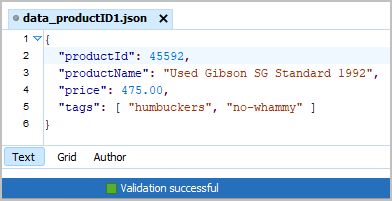
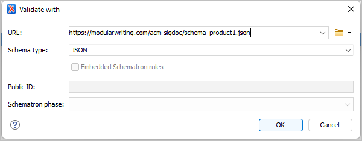

# Introduction to Structured Information (DRAFT)

In both industry and academia, we have numerous definitions for "structure". In various contexts, they are all useful. Let's start our inquiry by unpacking two of the prominent usages -- "formal structure" and "validating structure".   

"Formal structure" is quite familiar to us and connotes organizing our content in sequences, patterns, or recurring formats for the sake of consistency or reader impact. Classical rhetoric would call "formal structure" some form of "disposition" (*dispositio*). 

My first exposure to "formal structure" was in kindergarten. I had been writing both the upper-case and lower-case alphabet for a year, so the hours in class scrawling my way through letters on practice sheets was tedious. I decided that I should rush through each writing exercise to finish first. The senior of my two kindergarten teachers was unhappy with the carelessness of my work and once pulled two fourth graders (our idols) in for a look-see at a batch of our exercises. The taller of the two fourth graders remarked on my exercise, "This is really sloppy. Why would I read this one when so many of the others are neat!" Following the rules (literally) mattered. Thinking about how the content would be received mattered.  

"Validating structure" is a different beastie, having less to do with the disposition of the perceptible content and more with its underlying markup. My first exposure to "validating structure" was a negative one. I had just completed a long API documentation project which delivered hundreds of identically structured and formatted Microsoft Word files. My boss gathered several of us to meet with a consultant making the rounds through the company to talk about SGML and "structured authoring". In that first memorable meeting, we were informed that everything that we had been producing in Microsoft Word or Framemaker was "unstructured" content. We were not doing anything wrong, but none of it was really implemented in a way that made it "structured". For writers coming off projects that involved meticulous outlining, religiously consistent headings within API topics, and thorough editing, them's fightin' words and we, of course, did most everything in our limited spheres to impede or delay the roll-out of SGML and its notion of "structured content". 

It was then and remains today a distinction, but not a judgement. If the consultant had led with, "I'm here today to tell you about *hyper-epi-meta-mogrified content* and what it might mean for our future," I guarantee that we would have responded better as adults and professionals. No threat. No judgements. Room for partnership. 

From first grade through grad school I had been trained to produce logical and impactful writing. Whether I authored my content on a typewriter, cell phone, word processor, or dumb terminal, I and my colleagues shared a general sense of what constituted effectively structured content. That shared sense had NOTHING to do XML, schema, or validation. If 90% of the successful writers in an organization share a general sense of what constitutes a well-structured essay or help topic, you want to build on that collective understanding without attempting to replace it. 

"Formal structure" and "validating structure" are not exclusive, but complementary. Let's find out why. 

## So what does "validating structure" mean?

Think of validation as similar to what happens when you go for your drivers test. Long before the test, you've read and perhaps memorized parts of the driving handbook. You've also had some amount of practice time behind the wheel. The state trooper conducting your drivers test does not care how much prep time you have invested. He or she just wants to determine whether your driving behaviors during the road test comply with the driving handbook. If the handbook states that drivers look left *and* right at a four-way stop, your looking only to the right does not comply with the handbook and you quite possibly fail the test. If your driving is in strict compliance with the handbook, you pass. Whether you take the road test once or a dozen times, your performance in each instance of the road test will be evaluated by a trained trooper against that same drivers handbook. The three components in this example are the rules (driving handbook), the drive (road test), and the evaluator (state trooper).   

Shifting gears to content development and validation, we see these same three components.

* A set of rules -- a schema, database table design, or document type definition (DTD) 
* A document to be evaluated -- topic, map, database table, or JSON message   
* An evaluator -- parser or software validator
  
Here's how it works at an abstract level.

1. In my authoring tool, I choose **File** - **New** and specify a particular schema (set of rules) that I want to use for a new document.

    

    **Figure 1** Validation (validate_01.png)
    
2. My authoring tool creates that new document and typically adds to it a declaration statement that says, "Hey -- I am an instance of schema-X or schema-Y."

    

    **Figure 2** Validation (validate_02.png)

3. As I add content and markup to that new document, my authoring tool asks a built-in validator to get involved.

    

    **Figure 3** Validation (validate_03.png)

 
4. The validator compares what it sees in the document against the rules specified in the schema.

    

    **Figure 4** Validation (validate_04.png)
 
5. If the content and markup in the document conform to the rules specified in the schema, the document is considered **valid**.

    

    **Figure 5** Validation (validate_05.png)
  
6. If the content and markup in the document do not conform to the rules specified in the schema, the document is considered **invalid**. 	

    

    **Figure 6** Validation (validate_06.png)

If you create 100 instances of a particular schema or topic type, this validation process will ensure all 100 instances are consistent for you and for your co-workers. Any tools or bots that you develop will be able to read these 100 instances with confidence that they are structurally identical. In enterprise shops managing millions of individual documents, a content management systems will not let you commit an invalid document. 100% of all documents in the system need to be valid for the automated processing and publishing to work.  

Let's look at some real examples of structured information and validation. 
   
## Database example

Databases are probably the most familiar form of structured information. Database applications specify field names and field data types in "table definition". Here is a Microsoft Access table definition for a basic product inventory. 

** Figure x ** Database table definition (access_01.png)

Each product to be added to the inventory must have a product ID number (productId, number), a product name (productName, string), and price (price, currency). You specify that a field is "required" or optional in that "table definition". The fields productID, productName, and price are required; tags are optional. 

** Figure x ** Database table field attributes  (access_03.png)

Once you have defined the fields and data types that you want for your database table, you switch out of table design mode start adding content to your database. Each row of content is an instance of your table definition and must consist of the fields that conform to the "table definition" rules.   

** Figure x ** Database table records (access_02.png)

If the database application were to allow any deviations from the "table definition" rules, the database would not be able to search for content across the database table and return meaningful results. 

## JSON example

JSON (JavaScript Object Notation) is a popular markup language that supports the exchange of data between applications and between systems. Two applications can exchange JSON files and correctly process the structured data those files contain because the applications use a JSON schema to interpret each JSON data file. Let's look at one of these JSON schemas.

json_id0_well-formed.png

json_id0_valid2.png

json_id0_validate-with.png

 
** Figure xx ** JSON schema text

** Figure x ** JSON schema design

## JSON-LD example

OK. So forms of structured information such as JSON and databases handle discrete fields and bundles of moving data, but what  

## OASIS DITA example

