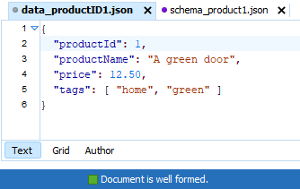
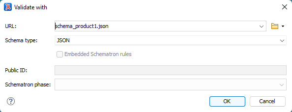
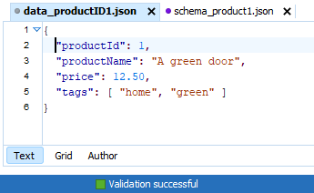
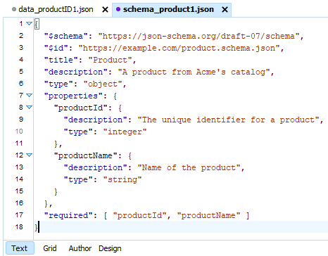
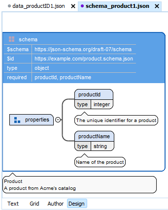

# Introduction to Structured Information (DRAFT)

In both industry and academia, we have numerous definitions for "structure"-- some complementary, others contradictory. In various contexts, they are all useful. Let's unpack the most prominent two -- formal structure and validating structure.   

My first exposure to "formal structure" was in kindergarten. I had been writing both the upper-case and lower-case alphabet for a year, so the hours in class scrawling my way through letters on practice sheets was tedious. I decided that I rush through each writing exercise to finish first. The senior of my two kindergarten teachers was unhappy with the carelessness of my work and once pulled two fourth graders (our idols) in for a look-see at a batch of our exercises. The taller of the two remarked on my exercise, "This is really sloppy. Why would I read this one when so many of the others are neat!" Following the rules (literally) mattered. Thinking about how the content would be received mattered.  

Much later, my first exposure to "validating structure" was a negative one. I had just completed a long API documentation project which delivered hundreds of identically structured and formatted Microsoft Word files. My boss gathered several of us to meet with a consultant making the rounds through the company to talk about SGML and "structured authoring". In that first memorable meeting, we were informed that everything that we had been producing in Microsoft Word or Framemaker was unstructured content. We were not doing anything wrong, but none of it was really implemented in a way that made it "structured". For writers coming off projects that involved meticulous outlining, religiously consistent headings within API topics, and thorough editing, them's fightin' words and we, of course, did most everything in our limited spheres to impede or delay the roll-out of SGML. 

Completely unnecessary conflict.

If the consultant had led with, "I'm here today to tell you about hyper-epi-meta- mogrified content and what it might mean for our future," I guarantee that we (I) would have responded better as adults and professionals. No threat. No judgements. 

Since first grade I had done my best to learn the forms and logic inherent to good academic and eventually professional writing. Those of us who have spent years writing term papers in Word or user guides in MadCap Flare have a working, lived sense of effectively structured content that has NOTHING to do XML, schema, or validation. If 90% of the successful writers in an organization share a general sense of what constitutes a well-structured essay or help topic, you want to build on that collective understanding without attempting to replace it.  

## So what does "valid" mean in "valid structure"?

Think of validation as similar to what happens when you go for your drivers test. Long before the test, you've read and perhaps memorized parts of the drivers handbook. You've also had some amount of practice time behind the wheel. The state trooper conducting your drivers test does not care how much prep time you have invested. He or she just wants to determine whether your driving behaviors during the road test comply with the laws and best practices documented in the driving handbook. If the handbook states that drivers look left *and* right at a four-way stop, your looking only to the right does not comply with the handbook and you quite possibly fail the test. If your driving is in strict compliance with the handbook, you pass. 

Whether you take the road test once or a dozen times, your performance in each instance of the road test will be evaluated by a trained trooper against that same drivers handbook. 

Shifting gears to content development, we see three components involved with validating structured content.

* A schema (set of rules): 
* A document (instance):  
* A validator: 
  
Here's how it works.

1. In my authoring tool, I choose File - New and specify a particular schema (set of rules) that I want to use for a new document.

    

    **Figure 1** Validation
    
2. My authoring tool creates that new document and adds some sort of declaration statement to it that says, "Hey -- I am an instance of schema-X or schema-Y."

    

    **Figure 2** Validation

3. Whenever I add content or tags to that new document, my authoring tool asks a built-in validator to get involved.

    

    **Figure 3** Validation

 
4. The validator compares what it sees in the document against rules specified in the schema.

    

    **Figure 4** Validation
 
5. If the content and tags in the document conform to the content and markup rules specified in the schema, the document is considered valid.

    

    **Figure 5** Validation
  
6. If the content and tags in the document do not conform to the content and markup rules specified in the schema, the document is considered invalid. 	

    

    **Figure 6** Validation

    Many content management systems will not let you commit an invalid document until you have addressed the issues involved and validated the document once again. 

If you create 100 instances of a particular schema or topic type, this validation process will always ensure all 100 instances are consistent. Furthermore, the 100 instances you create from the same schema will be consistent and usable for any other members of your team having access to that schema.  

## JSON example

JSON (JavaScript Object Notation) is a popular markup language that supports the exchange of data between applications and between systems. Two applications can exchange JSON files and correctly process the structured data those files contain because the applications use a JSON schema to interpret each JSON data file. Let's look at one of these JSON schemas.

 

** Figure x ** JSON sample

** Figure x ** JSON sample

** Figure x ** JSON sample

** Figure x ** JSON sample

** Figure x ** JSON sample

** Figure x ** JSON sample

## Database example

Databases are probably the most familiar form of structured information. Whereas JSON uses a schema to define required data fields, database applications specify field names and allowed field values in table definitions. Here is a Microsoft Access table definition for the same structured information as our JSON example.   

OK. So forms of structured information such as JSON and databases handle discrete fields and bundles of moving data, but what  

## OASIS DITA example

