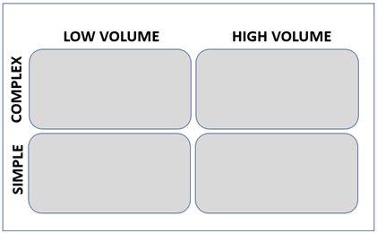
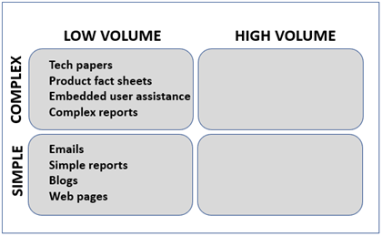
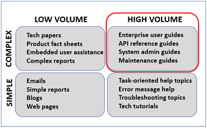

# Introduction to Structured Information

In both industry and academia, we have numerous definitions for "structure". In various contexts, they are all useful. Let's start our inquiry by unpacking two of the prominent usages -- "formal structure" and "validating structure".   

"Formal structure" is familiar to us and connotes organizing our content in sequences, patterns, or recurring formats for the sake of consistency and reader impact. Classical rhetoric would call "formal structure" some form of "disposition" (*dispositio*). 

My first exposure to "formal structure" was in kindergarten. I had been writing both the upper-case and lower-case alphabet for a year, so the hours in kindergarten class scrawling my way through letters on practice sheets was tedious. I decided that I should rush through each writing exercise to finish first. My kindergarten teacher was unhappy with my carelessness and once pulled two fourth graders (our idols) in for a look-see at our exercises. The taller of the two fourth graders remarked on my exercise, "This is really sloppy. Why would I read this one when so many of the others are neat!" Following the rules (literally) mattered. Thinking about how content is received does matter.  

"Validating structure" is less familiar and is a different beastie. It has less to do with the disposition of the perceptible content than its underlying markup. My first exposure to "validating structure" was a negative one. I had just completed a long API documentation project authored in hundreds of identically- -structured and -formatted Microsoft Word files. My boss gathered several of us to meet with a consultant making the rounds through the company to talk about SGML and "structured authoring". In that first memorable meeting, we were informed that everything that we had been producing in Microsoft Word or Framemaker was "unstructured" content. We were not doing anything wrong, but none of it was implemented in a way that gave it "structured" goodness. After months of diligent attention to the "structure" of our files, those was fightin' words and we, of course, did most everything in our limited spheres to impede or delay the roll-out of SGML and its notion of "structured content". 

If the consultant had led with something like, "I'm here today to tell you about *hyper-epi-meta-mogrified content* and what it might mean for our future." I guarantee that we writers would have responded differently. No threat. No judgements. Lots of room for discussion and partnership. 

From grammar school through grad school, we had been trained to produce logical and impactful writing. Whether we authored content on a typewriter, cell phone, word processor, or dumb terminal, we shared a general sense of what constituted effectively structured content. *That* shared sense of structure had NOTHING to do XML, schema, or validation.  

"Formal structure" and "validating structure" are not exclusive, but complementary. Let's find out why. 

## So what does "validating structure" mean?

Think of validation as similar to what happens when you go for a driving test. Long before the test, you've read and perhaps memorized parts of the driving handbook. You've also had some amount of practice time behind the wheel. The state trooper conducting your driving test does not care how much prep time you have invested. The trooper just wants to determine whether your driving behaviors during the road test comply with the driving handbook. If the handbook states that drivers must look left *and* right at a four-way stop, your looking only to the right does not comply with the handbook and you quite possibly fail the test. If your driving is in strict compliance with the handbook, you pass. Whether you take the road test once or a dozen times, your performance in each instance of the road test will be evaluated by a trained trooper against that same driving handbook. The three components in this example are the rules (driving handbook), the test instance (road test), and the evaluator (state trooper).   

Shifting gears to content development and validation, we see roughly the same three components.

* A set of rules -- a schema, database table design, or document type definition (DTD) 
* A document instance to be evaluated -- topic, map, database table, or JSON message   
* An evaluator -- parser or software validator
  
Here's how it works at an abstract level.

1. In my authoring tool, I choose **File** - **New** and specify a particular schema (set of rules) that I want to use for a new document.

    

    **Figure 1** Validation (validate_01.png)
    
2. My authoring tool creates an instance of that schema and adds to it a declaration statement that says, "Hey -- I am an instance of schema-X or schema-Y."

    

    **Figure 2** Validation (validate_02.png)

3. As I add content and markup to that new document, my authoring tool asks a built-in validator to get involved.

    

    **Figure 3** Validation (validate_03.png)

 
4. The validator compares what it sees in the document against the rules specified in the schema.

    

    **Figure 4** Validation (validate_04.png)
 
5. If the content and markup in the document conform to the rules specified in the schema, the document is considered **valid**.

    

    **Figure 5** Validation (validate_05.png)
  
6. If the content and markup in the document do not conform to the rules specified in the schema, the document is considered **invalid**. 	

    

    **Figure 6** Validation (validate_06.png)

If you create 100 instances of a particular schema or topic type, this validation process will ensure that all 100 instances are structurally valid for you and for your co-workers. Any tools or bots that you develop will be able to read these 100 instances with the confidence that they can be processed identically. In enterprise shops managing millions of individual documents, content management systems will not let you commit an invalid document. 100% of all documents in the system need to be valid for the automated processing and publishing to work.  

Let's look at some real examples of structured information and validation. 
   
## Database example

Databases are probably the most familiar form of structured content. Database applications specify field names and field data types in a "table definition". Here is a Microsoft Access table definition for a basic product inventory. 

**Figure 7** Database table definition (access_01.png)

Each product to be added to the inventory must have a product ID number (``productId``, number), a product name (``productName``, string), and price (``price``, currency). You specify that a field is "required" or optional in that "table definition". The fields ``productID``, ``productName``, and ``price`` are required. 

**Figure 8** Database table field attributes  (access_03.png)

The ``tag`` field is optional.

Once you have defined the fields and data types that you want in your table definition, you can switch out of table design mode start adding content to your database. Each row of content is an instance (record) of your table definition and must contain the fields that conform to the "table definition" rules.   

**Figure 9** Database table records (access_02.png)

If the database application were to allow any deviations from the "table definition" rules, the database would not be able to search for content across the database table and return meaningful results. 

## JSON example

JSON (JavaScript Object Notation) is a popular markup language that supports the exchange of data between applications and between systems. JSON files and messages consist of a collection of name:value pairs such as ``productId: 45592``. 

As with any markup language, JSON has rules about syntax -- all those brackets, braces, quotation marks, and punctuation. One set of rules for JSON syntax is [https://json-schema.org/draft-07/schema](https://json-schema.org/draft-07/schema "https://json-schema.org/draft-07/schema"). If the syntax in a JSON data file conforms to ``draft-07/schema``, the JSON data file is evaluated to be "well-formed". The syntax of all its statements is correct.   

**Figure 10** Well-formed JSON data (json_id0_well-formed2.png)

Using the correct syntax in the JSON data files exchanged between applications is important, but how do the applications interpret the name:value pairs contained in JSON data files? In addition to a schema for markup syntax, JSON relies on schema definitions the way database applications rely upon table definitions. 

**Figure 11** JSON schema text (json_10.png)

This schema definition specifies the JSON syntax schema to be used (line 1) and provides an ID (URL) for itself (line 2).        

The JSON example here is derived from the wonderful ``json-schem.org`` tutorial   [https://json-schema.org/learn/getting-started-step-by-step.html](https://json-schema.org/learn/getting-started-step-by-step.html "Getting Started Step-By-Step"). This schema is in turn an instance of the general "Product" schema defined in [https://schema.org/](https://schema.org/ "schema.org") as [https://schema.org/Product](https://schema.org/Product "Product"). Google, Microsoft, Yahoo, and other companies formed schema.org as a "collaborative, community activity with a mission to create, maintain, and promote schemas for structured data on the Internet, on web pages, in email messages, and beyond." If I want use JSON to collect information about multiple product inventories, I would not need to start from scratch each time in defining my particular JSON schema. I simply pick and choose which properties (fields) I want from the generic schema.org schema for "Product".  
 
In this instance, the properties ``productId``, ``productName``, and ``price`` are required to be in any JSON data file that uses this schema. These are the same properties (fields) that we viewed in our previous database table definition. 

**Figure 12** JSON schema design (json_schema_design.png)

First, the JSON validator reads the simplified schema definition that I posted to my web site ([https://modularwriting.com/acm-sigdoc/schema_product1.json](https://modularwriting.com/acm-sigdoc/schema_product1.json "https://modularwriting.com/acm-sigdoc/schema_product1.json")). 

**Figure 13** JSON validation (json_id0_validate-with2.png)

Then the validator compares the name:value pairs in my JSON data file (``data_productID1.json``) to the schema definition. If the syntax and structure of the name:value pair properties in ``data_productID1.json`` conform to ``schema_product1.json``, the JSON data file is evaluated as "valid" and the application can safely integrate its data.     

**Figure 13** JSON validation (json_id0_valid3.png)

What makes JSON interesting is that *any* application worldwide that can access the schema definition on the web can validate and exchange JSON messages with any other application. Exchanging valid information becomes a global, web-aware opportunity.    

OK. This "validating structure" is all well and good for fragmentary, name:value information, but how does it add any value to web content or to product documentation? Let's look at web content first.       

## JSON-LD example

Web pages encoded in HTML5 have no schema or document type definition (DTD) against which a validator can test compliance. That is unlikely to change.

Although an HTML5 web page cannot be validated as a document, that does not mean that important keywords and other information contained in that web page cannot be captured as a block of structured content and stored in that web page. 

[JSON for Linking Data](https://json-ld.org/ "JSON for Linking Data") (JSON-LD) is a Worldwide Web Consortium (W3C) [standard](https://www.w3.org/TR/json-ld11/ "standard") designed to "create a network of standards-based, machine-readable data across Web sites. It allows an application to start at one piece of Linked Data and follow embedded links to other pieces of Linked Data that are hosted on different sites across the Web."  

How does it work? Basically, a human being or an application such as the [Google Tag Manager](https://developers.google.com/search/docs/advanced/structured-data/generate-structured-data-with-javascript "Google Tag Manager") adds a JavaScript ``
      <body>
      <H1>Executive Anvil</H1>
      . . . 
      </body>
    </HTML>     

When an application reads thousands of web pages containing these embedded blocks of structured data, it can validate the ``<script>`` in the web page and construct a machine-readable network of keywords and links between those web pages. This network visualization or "graph" allows web pages that are not structured to contribute to a distributed, validating structure. 

Working with structured information is not an all-or-nothing affair. You can author the majority of your content in a "formal structure" such as HTML5 while parts of it contribute to a "validating structure" conversation.  

## OASIS DocBook and DITA examples

I suspect that you are seeing the motivation behind teams adopting "validating structures" -- scalability.

If you do most of your writing on small teams, it is unlikely that you are producing more than a few hundred documents, publishing them frequently, or publishing them as one collection. 

Do you need to have all your documents derived from the same set of schemas or DTDs? No. 

If you need to *scale up* -- increase the number of your documents from 100 to 500,000. Yes.

If you need to *scale out* -- increase the ways that the information in those documents gets used and reused. Yes.

In the 1990s, organizations responsible for publishing millions of pages of specifications, maintenance manuals, user guides, and catalogs perceived the need schema that would allow large, distributed teams to author, assemble, and publish large documents from valid, identically-structured small documents. 

The first industry standard for "validating structure" documentation was called DocBook and is now maintained by the [Organization for the Advancement of Structured Information Systems](https://www.oasis-open.org/committees/tc_home.php?wg_abbrev=docbook "Organization for the Advancement of Structured Information Systems") (OASIS). Just as individual, custom JSON schema for product inventories are all derived from the "Product" schema on schema.org, all DocBook document type definitions (DTDs) are derived from the definitive DocBook schema [Version 5.1.1](https://docs.oasis-open.org/docbook/docbook/v5.1.1/csd01/docbook-v5.1.1-csd01.html "Version 5.1.1").    

As we saw with JSON validation, every DocBook document needs to identify its markup syntax (``<?xml version="1.0" encoding="UTF-8"?>``) and the schema that defines which elements and attributes are allowed (``http://docbook.org/ns/docbook``).  

    <?xml version="1.0" encoding="UTF-8"?>
    <book xml:id="my_tiny_book" xmlns="http://docbook.org/ns/docbook" version="5.0">
      <title>My first tiny book</title>
      <chapter xml:id="tiny-book_chapter1">
        <title>Chapter 1: My journey</title>
        <para>Welcome readers!</para>
        <para>This is my first paragraph.</para>
        . . .
      </chapter>
      <chapter xml:id="tiny-book_chapter2">
        <title>Chapter 2: Childhood bliss</title>
        <para>One dark and stormy night . . . </para>
        . . .
      </chapter>
     </book>

The [Worldwide Web Consortium](https://www.w3.org/ "Worldwide Web Consortium") (W3C) maintains the standard for the [Extensible Markup Language](https://www.w3.org/XML/ "Extensible Markup Language") (XML). As with HTML, XML uses angle brackets to identify elements such as ``book`` and separating spaces to identify attributes such as ``xml:id`` within those elements. This sample DocBook file is a publication with the title "My first tiny book" and contains two chapters. For large, linear-architecture publications such as reference manuals or catalogs, DocBook continues to deliver the goods. 

For modular, topic-based writing, DocBook has been superseded by its OASIS cousin the [Darwin Information Typing Architecture](https://www.oasis-open.org/committees/tc_home.php?wg_abbrev=dita "Darwin Information Typing Architecture") (DITA). What DITA brings to the party are:

* *Topic types*: Separate DTDs for concept, reference, and task information.
* *Maps*: A document that assembles and organizes the separate topics.
* *Inheritance*: Within maps and topics, objects lower in the hierarchy inherit settings defined at higher levels. 
* *Conditional assembly*: Filtering attributes can be set to include or exclude content according to filtering profiles.
* *Semantic markup*: Element names described their content, for example ``<menuitem>`` instead of ``<b>``.
* *Content reuse mechanisms*: Content can be included by reference using multiple techniques.
* *Specialization*: Existing elements can be constrained or refactored into new elements.

In the context of our discussion, what makes DITA interesting is that it does not limit the number of topic DTDs that you use in one publication. I can make my 10 definitions consistent across my publication by using 10 concept topics (``concept.dtd``) while making my 200 procedures consistent by using task topics (``task.dtd``). Furthermore, I can customize these out-of-the-box topic types to create DTDs that address my company-specific requirements. 

* Generic topic
	* ``<!DOCTYPE topic PUBLIC "-//OASIS//DTD DITA Topic//EN" "topic.dtd">`` 
* [Concept topic](http://docs.oasis-open.org/dita/dita/v1.3/errata02/os/complete/part3-all-inclusive/archSpec/technicalContent/dita-concept-topic.html#dita_concept_topic "Concept topic")
 * ``<!DOCTYPE concept PUBLIC "-//OASIS//DTD DITA Concept//EN" "concept.dtd">``
* [Task topic](http://docs.oasis-open.org/dita/dita/v1.3/errata02/os/complete/part3-all-inclusive/archSpec/technicalContent/dita-task-topic.html#dita_task_topic "Task topic")
  * ``<!DOCTYPE task PUBLIC "-//OASIS//DTD DITA Task//EN" "task.dtd">``
* [Reference topic](http://docs.oasis-open.org/dita/dita/v1.3/errata02/os/complete/part3-all-inclusive/archSpec/technicalContent/dita-reference-topic.html#dita_ref_topic "Reference topic")
 * ``<!DOCTYPE reference PUBLIC "-//OASIS//DTD DITA Reference//EN" "reference.dtd">``
* [Glossary topic](http://docs.oasis-open.org/dita/dita/v1.3/errata02/os/complete/part3-all-inclusive/archSpec/technicalContent/dita-glossary-topic.html#glossaryArch "Glossary entry topic")
 * ``<!DOCTYPE glossentry PUBLIC "-//OASIS//DTD DITA Glossary Entry//EN" "glossaryentry.dtd">
`` 
* [Troubleshooting topic](http://docs.oasis-open.org/dita/dita/v1.3/errata02/os/complete/part3-all-inclusive/archSpec/technicalContent/dita-troubleshooting-topic.html#dita-troubleshooting-topic "Troubleshooting topic")
 * ``<!DOCTYPE troubleshooting PUBLIC "-//OASIS//DTD DITA Troubleshooting//EN" "troubleshooting.dtd">``   

What transforms a collection of separate topics into a publication is the DITA map. It references the stand-alone topics and provides the content organization for your publication.

**Figure 14** DITA maps (dita_map1.png, dita_map2.png)

   

To the extent that any topic can be referenced from multiple maps, the potential for content reuse is high. 

## Conclusion

Is structured content appropriate for all types of content development? Heck no. That said, assuming that you'd never need to know something about it or never work for a company that required structured content would be short sighted. If you are early in your career, there are two good reasons to consider learning more about structured information. 

### Machine learning and robotics

Twenty years ago, you could make the case that technical content  was consumed almost exclusively by other human beings -- our internal reviewers and external customers. No more. Machine learning involves software applications reading information from  the web and assimilating into structures upon which it can act. Machine learning is the on-ramp to artificial intelligence which is the foundation for cutting-edge robotics. 

If you have a working understanding of structured content and how that feeds machine learning, your career in content development may take a decidedly positive turn. Making sense of that boundary between unstructured content that people produce and the structured  content the machine learning systems need is *the* challenge. Consider being a part of it. 

### Enterprise content development

Developing content in any particular information architecture requires an investment -- tooling, training, testing, deployment, and maintenance. Relative to what you invest, the benefits to you and to your customers constitute your return on investment (ROI). The variables to consider when looking at an information architecture to adopt are volume and complexity. 

**Figure 15** Investment quadrants (quadrants_01.png)

   

Whether the documents that you are producing are simple or complex, the motivation to automate or machine-ingest small numbers of documents is pretty weak. If you are working in small volumes, it is unlikely that you'd see much of a return on investment if you developed DTDs or schema for memos, emails, or technical papers. Automating your document life cycle or submitting small numbers of blogs or web pages into a machine learning system will do little but reduce your productivity. 

**Figure 16** Investment quadrants (quadrants_02.png)

   

At higher document volumes or complexity, you do not want to maintain manual tasks or processing variations in your workflow. You want your publishing systems to process thousands of valid, structured documents in a matter of minutes.  

**Figure 17** Investment quadrants (quadrants_03.png)

   

Becoming familiar with some of the basic concepts of structured authoring and being able to work up a few samples will serve you well. The companies with high-volume content and complex architectures tend to be enterprise software, hardware, and service companies always looking for fresh talent. Demonstrating to these enterprise shops that you have interest and a working knowledge of the basics can be advantageous.    

**Figure 18** Investment quadrants (quadrants_04.png)

   

To learn more about structured content development, see our [ACM Learning Guide]. 
 
       

